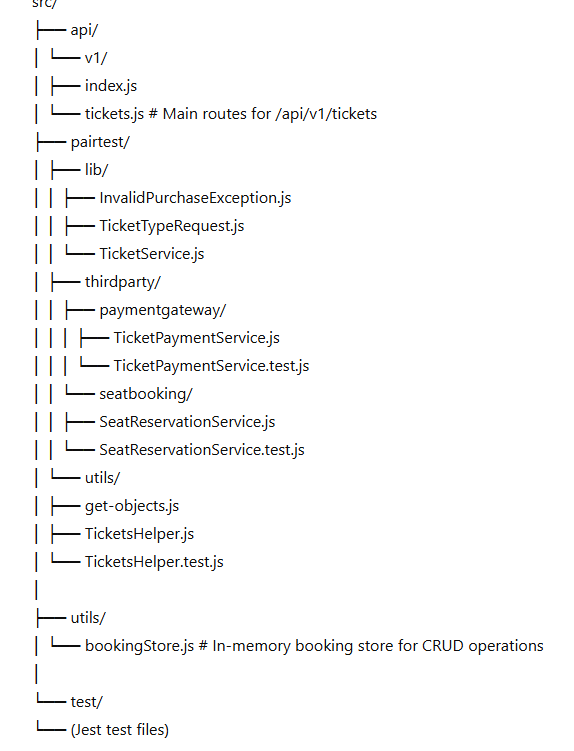

# 🎟️ Cinema Tickets API Service

A simple Node.js + Express API project to handle cinema ticket bookings with validation, payment simulation, and seat reservation logic.

This project demonstrates clean architecture principles (service-based + dependency injection), test coverage using Jest, and basic CRUD operations for managing ticket bookings.

-----------

## 🚀 Features

- Purchase cinema tickets (with validation & seat/payment simulation)
- Retrieve all bookings for an account
- Retrieve a specific booking by ID
- Update existing bookings (re-validate and recalculate totals)
- Cancel (soft delete) bookings
- Jest-based unit tests for service and utility layers

----------

## 🧩 Project Structure

----------

## 🛠️ Prerequisites

- **Node.js** ≥ 16.15.1  
- **npm** ≥ 8.x  
- **Express.js** version 4.18.2

------------

## ⚙️ Installation

# Clone repository
git clone https://github.com/<your-username>/cinema-tickets-nodejs.git
cd cinema-tickets-nodejs

# Install dependencies
npm install

----------

▶️ Run the Application
# Start the Express server
npm start

By default, the app runs on http://localhost:8081

---------------

🧪 Run Unit Tests
npm test

This runs Jest unit tests with code coverage.

-------------

🧾 API Reference
Base URL
http://localhost:8081/api/v1

-------------

🎫 1. Purchase Tickets (POST)

Endpoint:

POST /tickets

Example Request Body:

{
  "accountid": 123,
  "ticketRequests": [
    { "ticketType": "ADULT", "noOfTickets": 2 },
    { "ticketType": "CHILD", "noOfTickets": 1 }
  ]
}

Response:

{
  "success": true,
  "booking": {
    "id": "2e3a1c8f-9a45-4b15-8e13-2c9c98a28b2e",
    "accountId": 123,
    "totalAmount": 40,
    "totalSeats": 3,
    "status": "CONFIRMED"
  }
}

--------------

📋 2. Get All Bookings for an Account (GET)

Endpoint:

GET /tickets/account/:accountId

Example:

GET /tickets/account/123

-------------

🔍 3. Get Booking by ID (GET)

Endpoint:

GET /tickets/:bookingId

Example:

GET /tickets/2e3a1c8f-9a45-4b15-8e13-2c9c98a28b2e

--------------

✏️ 4. Update Booking (PUT)

Endpoint:

PUT /tickets/:bookingId

Example Request Body:

{
  "ticketRequests": [
    { "ticketType": "ADULT", "noOfTickets": 3 },
    { "ticketType": "CHILD", "noOfTickets": 1 }
  ]
}

-----------

❌ 5. Cancel Booking (DELETE)

Endpoint:

DELETE /tickets/:bookingId

Example Response:

{
  "success": true,
  "message": "Booking cancelled (soft). Implement refunds/seatrelease in production."
}

--------------

🧠 Design Notes

TicketService handles validation, price calculation, and interactions with mock services:

TicketPaymentService – simulates payments.

SeatReservationService – simulates seat booking.

Dependency Injection is used for better testability.

bookingStore.js uses a simple in-memory Map; replace with MongoDB, PostgreSQL, or Redis for production use.

Error handling is done via InvalidPurchaseException.

-----------

🧰 Useful Commands
Command	Description
npm install	Install dependencies
npm start	Run Express server
npm test	Run Jest tests
npm run lint	(Optional) Run ESLint for code quality

----------

📁 Environment Variables

Create a .env file in the project root if you wish to customize configs.

PORT=8081
NODE_ENV=development

----------

🧾 License

This project is open-source and available under the MIT License
